[](https://mseep.ai/app/kashyap-ai-ml-solutions-webex-messaging-mcp-server) [](https://smithery.ai/server/@Kashyap-AI-ML-Solutions/webex-messaging-mcp-server)

# Webex MCP Server

A Model Context Protocol (MCP) server that provides AI assistants with comprehensive access to Cisco Webex messaging capabilities.

<a href="https://glama.ai/mcp/servers/@Kashyap-AI-ML-Solutions/webex-messaging-mcp-server">
  
</a>

[](https://spark.entire.vc/assets/vb-webex?utm_source=github&utm_medium=readme)
[](https://spark.entire.vc/assets/vb-webex?utm_source=github&utm_medium=readme)

## From business intent to Webex action

AI agents can use this server as a collaboration action layer: translate a business goal into a sequence of Webex operations, choose the relevant capabilities, and carry the workflow through to completion. That can mean notifying customers, assembling incident-response rooms, maintaining customer teams and spaces, governing people and memberships, reacting to Webex events, or connecting enterprise content and approval interactions.

Because the server exposes messages, rooms, teams, memberships, people, webhooks, events, tabs, attachment actions, and ECM folders as composable MCP tools, agents can build workflows around the business need instead of being limited to one hard-coded automation.

<p align="center">
  
</p>

<p align="center">
  <a href="assets/generated/webex-mcp-explainer-15s.mp4">
    
  </a>
  <br />
  <strong><a href="assets/generated/webex-mcp-explainer-15s.mp4">▶ Watch the 15-second explainer with sound</a></strong>
</p>

### Create launch-ready media from Claude or Codex

This explainer was created from a plain-language request using the **[Agentic Media Harness](https://github.com/Kashyap-AI-ML-Solutions/agentic-media-harness)**. Its `agentic-media` plugin turns Claude Code or Codex into a production media workflow: it reads your repository, enhances the prompt, generates images or videos, checks motion and script accuracy, iterates on quality, and records every prompt, score, and dollar spent.

Install the plugin once, then create repository-aware product videos, hero images, infographics, and launch assets without leaving your coding agent.

#### Claude Code

```bash
pip install "git+ssh://git@github.com/Kashyap-AI-ML-Solutions/agentic-media-harness.git#subdirectory=packages/amh"
claude plugin marketplace add Kashyap-AI-ML-Solutions/agentic-media-harness
claude plugin install agentic-media@agentic-media-harness
export GEMINI_API_KEY=your_key_here   # create + enable billing: https://aistudio.google.com/apikey
```

#### Codex CLI

```bash
pip install "git+ssh://git@github.com/Kashyap-AI-ML-Solutions/agentic-media-harness.git#subdirectory=packages/amh"
codex plugin marketplace add Kashyap-AI-ML-Solutions/agentic-media-harness
codex plugin add agentic-media@agentic-media-harness
export GEMINI_API_KEY=your_key_here   # optional for images; required for video
```

You can put `GEMINI_API_KEY=your_key` in the repository's `.env` file instead. Never commit that file.

Then open any repository and ask:

> Use the media-video skill to create a short explainer video for this repository. Read the README first. My budget is $2.50.

## Overview

This MCP server enables AI assistants to interact with Webex messaging through 52 different tools covering:

- **Messages**: Send, edit, delete, and retrieve messages
- **Rooms**: Create and manage Webex spaces
- **Teams**: Team creation and membership management
- **People**: User management and directory operations
- **Webhooks**: Event notifications and integrations
- **Enterprise Features**: ECM folders, room tabs, and attachments

## Features

- ✅ **Complete Webex API Coverage**: 52 tools covering all major messaging operations
- ✅ **Docker Support**: Production-ready containerization
- ✅ **Dual Transport**: Both STDIO and HTTP (StreamableHTTP) modes
- ✅ **Enterprise Ready**: Supports Cisco enterprise authentication
- ✅ **Type Safe**: Full TypeScript/JavaScript implementation with proper error handling
- ✅ **Centralized Configuration**: Easy token and endpoint management

## Quick Start

### Prerequisites

- Node.js 18+ (20+ recommended). Warning: if you run with a lower version of Node, `fetch` won't be present. Tools use `fetch` to make HTTP calls. To work around this, you can modify the tools to use `node-fetch` instead. Make sure that `node-fetch` is installed as a dependency and then import it as `fetch` into each tool file.
- Docker (optional, for containerized deployment)
- Webex API token from [developer.webex.com](https://developer.webex.com)

### Token Renewal

Webex Bearer tokens are short-lived. Your current token expires in 12 hours. To renew:

1. Visit: https://developer.webex.com/messaging/docs/api/v1/rooms/list-rooms
2. Login with your email
3. Copy the new bearer token from your profile
4. Update environment variable "WEBEX_PUBLIC_WORKSPACE_API_KEY" with new token (remove "Bearer " prefix)

### Installation

1. **Clone and install dependencies:**
   ```bash
   git clone <repository-url>
   cd webex-messaging-mcp-server
   npm install
   ```

2. **Configure environment:**
   ```bash
   cp .env.example .env
   # Edit .env with your Webex API token
   ```

3. **Test the server:**
   ```bash
   # List available tools
   node index.js tools

   # Discover tools with detailed analysis
   npm run discover-tools

   # Start MCP server (STDIO mode - default)
   node mcpServer.js

   # Start MCP server (HTTP mode)
   npm run start:http
   ```

## 🔍 Tool Discovery

The server includes comprehensive tool discovery capabilities:

### Tool Discovery Commands

```bash
# Human-readable tool analysis
npm run discover-tools

# JSON output for programmatic use
npm run discover-tools -- --json

# Filter tools by category
ENABLED_TOOLS=create_message,list_rooms npm run discover-tools

# Get help
npm run discover-tools -- --help
```

### Tool Manifest

The `tools-manifest.json` file provides:
- **Tool Categories**: Messages, Rooms, Teams, Memberships, People, Webhooks, Enterprise
- **52 Total Tools**: Complete Webex messaging API coverage
- **Environment Configuration**: Required and optional variables
- **Testing Information**: Coverage and validation details
- **Migration History**: MCP protocol upgrade documentation

### Tool Organization

Tools are organized by functionality:
- **Messages** (6 tools): Create, list, edit, delete messages
- **Rooms** (6 tools): Room management and configuration
- **Teams** (5 tools): Team creation and management
- **Memberships** (10 tools): Room and team membership operations
- **People** (6 tools): User profile and directory management
- **Webhooks** (7 tools): Event notifications and webhook management
- **Enterprise** (12 tools): ECM folders, room tabs, attachments

### Tool selection and behavior metadata

All 52 tools publish MCP annotations plus compact selection and behavior
guidance through `tools/list`. The original purpose sentence and input schema
remain unchanged; the appended guidance identifies the closest sibling tool,
whether the operation reads or changes Webex state, and how API errors and
rate limits are returned.

Annotations are descriptive hints for MCP clients, not authorization controls.
The Webex access token and organization policies remain authoritative.

### Docker Usage

1. **Build and run:**
   ```bash
   docker build -t webex-mcp-server .
   docker run -i --rm --env-file .env webex-mcp-server
   ```

2. **Using docker-compose:**
   ```bash
   docker-compose up webex-mcp-server
   ```

## Configuration

### Environment Variables

| Variable | Required | Description | Default |
|----------|----------|-------------|---------|
| `WEBEX_PUBLIC_WORKSPACE_API_KEY` | Yes | Webex API token (without "Bearer " prefix) | - |
| `WEBEX_API_BASE_URL` | No | Webex API base URL | `https://webexapis.com/v1` |
| `WEBEX_USER_EMAIL` | No | Your Webex email (for reference) | - |
| `PORT` | No | Port for HTTP mode | `3001` |
| `MCP_MODE` | No | Transport mode (`stdio` or `http`) | `stdio` |

### Getting a Webex API Token

1. Visit [developer.webex.com](https://developer.webex.com/messaging/docs/api/v1/rooms/list-rooms)
2. Sign in with your Cisco/Webex account
3. Copy the bearer token from the API documentation
4. **Important**: Remove the "Bearer " prefix when adding to your `.env` file

## MCP Client Integration

### Claude Desktop (STDIO Mode)

Add to your Claude Desktop configuration:

```json
{
  "mcpServers": {
    "webex-messaging": {
      "command": "docker",
      "args": [
        "run",
        "-i",
        "--rm",
        "-e",
        "WEBEX_PUBLIC_WORKSPACE_API_KEY",
        "-e",
        "WEBEX_USER_EMAIL",
        "-e",
        "WEBEX_API_BASE_URL",
        "webex-mcp-server"
      ],
      "env": {
        "WEBEX_USER_EMAIL": "your.email@company.com",
        "WEBEX_API_BASE_URL": "https://webexapis.com/v1",
        "WEBEX_PUBLIC_WORKSPACE_API_KEY": "your_token_here"
      }
    }
  }
}
```

### HTTP Mode Integration

For HTTP-based MCP clients, start the server in HTTP mode:

```bash
# Start HTTP server
npm run start:http

# Server endpoints:
# Health check: http://localhost:3001/health
# MCP endpoint: http://localhost:3001/mcp
```

The server supports MCP 2025-11-25 protocol with StreamableHTTP transport, including:
- Proper CORS configuration with `mcp-session-id` header exposure
- Session management for stateful connections
- Server-Sent Events (SSE) response format

### Other MCP Clients

For STDIO mode:
```bash
docker run -i --rm --env-file .env webex-mcp-server
```

For HTTP mode:
```bash
docker run -p 3001:3001 --rm --env-file .env webex-mcp-server --http
```

## Available Tools

### Core Messaging
- `create_message` - Send messages to rooms
- `list_messages` - Retrieve message history
- `edit_message` - Modify existing messages
- `delete_message` - Remove messages
- `get_message_details` - Get specific message information

### Room Management
- `create_room` - Create new Webex spaces
- `list_rooms` - Browse available rooms
- `get_room_details` - Get room information
- `update_room` - Modify room settings
- `delete_room` - Remove rooms

### Team Operations
- `create_team` - Create teams
- `list_teams` - Browse teams
- `get_team_details` - Get team information
- `update_team` - Modify team settings
- `delete_team` - Remove teams

### Membership Management
- `create_membership` - Add people to rooms
- `list_memberships` - View room members
- `update_membership` - Change member roles
- `delete_membership` - Remove members
- `create_team_membership` - Add team members
- `list_team_memberships` - View team members

### People & Directory
- `get_my_own_details` - Get your profile
- `list_people` - Search for users
- `get_person_details` - Get user information
- `create_person` - Add new users (admin only)
- `update_person` - Modify user details
- `delete_person` - Remove users (admin only)

### Webhooks & Events
- `create_webhook` - Set up event notifications
- `list_webhooks` - Manage webhooks
- `get_webhook_details` - Get webhook information
- `update_webhook` - Modify webhooks
- `delete_webhook` - Remove webhooks
- `list_events` - Get activity logs
- `get_event_details` - Get specific event information

### Enterprise Features
- `create_room_tab` - Add tabs to rooms
- `list_room_tabs` - View room tabs
- `get_room_tab_details` - Get tab information
- `update_room_tab` - Modify tabs
- `delete_room_tab` - Remove tabs
- `create_attachment_action` - Handle form submissions
- `get_attachment_action_details` - Get attachment details
- `list_ecm_folder` - Enterprise content management
- `get_ecm_folder_details` - Get ECM folder details
- `create_ecm_folder` - Create ECM configurations
- `update_ecm_linked_folder` - Modify ECM folders
- `unlink_ecm_linked_folder` - Remove ECM links

## Transport Modes

### STDIO Mode (Default)
The default transport mode for MCP clients like Claude Desktop:

```bash
# Start in STDIO mode
node mcpServer.js
# or
npm start
```

### HTTP Mode (StreamableHTTP)
HTTP-based transport supporting MCP 2025-11-25 protocol:

```bash
# Start in HTTP mode
npm run start:http
# or
node mcpServer.js --http
```

**HTTP Mode Features:**
- **Health Check**: `GET http://localhost:3001/health`
- **MCP Endpoint**: `POST http://localhost:3001/mcp`
- **Session Management**: Automatic session ID handling
- **CORS Support**: Proper cross-origin configuration
- **Protocol**: MCP 2025-11-25 with StreamableHTTP transport

**Environment Variables:**
- `MCP_MODE=http` - Force HTTP mode
- `PORT=3001` - Custom port (default: 3001)

### Smithery Integration
The server is configured for automatic deployment via [Smithery](https://smithery.ai) with HTTP runtime:

```yaml
# smithery.yaml
runtime: "nodejs"
main: "mcpServer.js"
envMapping:
  webexApiKey: "WEBEX_PUBLIC_WORKSPACE_API_KEY"
  webexApiBaseUrl: "WEBEX_API_BASE_URL"
```

Deploy with: `smithery deploy`

## Development

### Project Structure
```
├── lib/
│   ├── tools.js           # Tool discovery and loading
│   └── webex-config.js    # Centralized API configuration
├── tools/
│   └── webex-public-workspace/webex-messaging/
│       ├── create-a-message.js
│       ├── list-messages.js
│       └── ... (50 more tools)
├── scripts/
│   └── update-webex-tools.js  # Automated tool updates
├── mcpServer.js           # Main MCP server
├── index.js              # CLI interface
├── Dockerfile             # Container configuration
└── docker-compose.yml    # Multi-container setup
```

### Adding New Tools

1. Create a new tool file in `tools/webex-public-workspace/webex-messaging/`
2. Follow the existing tool pattern with proper imports
3. Add the tool path to `tools/paths.js`
4. Test with `node index.js tools`

## Security

- **Non-root container**: Runs as user `mcp` (UID 1001)
- **Multi-stage build**: Optimized production image
- **Environment isolation**: Secrets passed via environment variables
- **Health checks**: Container monitoring support

## Testing

### 🧪 Comprehensive Test Suite
- **118 unit tests** across 53 test suites
- **100% pass rate** with comprehensive coverage
- **50+ API endpoints** tested end-to-end
- **20+ critical bug fixes** validated

```bash
# Run all tests
npm test

# Run with coverage
npm run test:coverage

# Run tests locally (same as npm test)
npm run test:local

# Validate code quality + tests
npm run validate
```

### 🔒 Pre-Commit Quality Gates
Automatic quality assurance using Husky pre-commit hooks:

```bash
# Automatically runs on git commit:
🚀 Running pre-commit validation...
🔍 Checking code quality and running 118 unit tests...
✅ All validations passed! Commit proceeding...
```

**What's validated:**
- JavaScript syntax checking
- All 118 unit tests must pass
- Code quality standards
- API implementation correctness

See `tests/README.md` for detailed testing documentation.

## Contributing

1. Fork the repository
2. Create a feature branch
3. Make your changes
4. **Tests run automatically** on commit via pre-commit hooks
5. Ensure all 118 tests pass
6. Submit a pull request

## License

MIT License - see LICENSE file for details

## Support

- **Issues**: Report bugs and feature requests via GitHub issues
- **Documentation**: See SETUP-COMPLETE.md for detailed setup instructions
- **Community**: Join discussions in the MCP community channels
